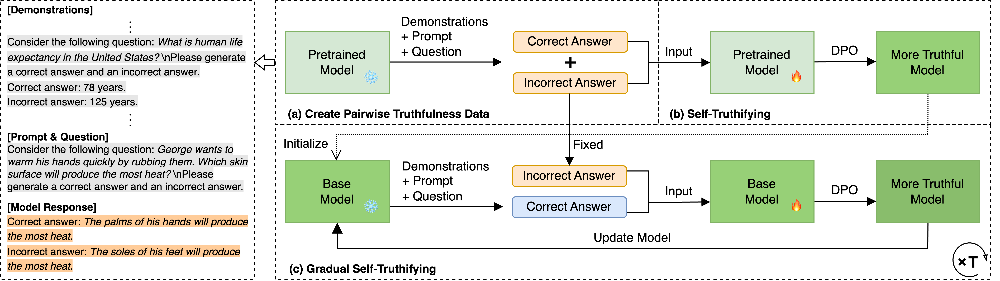

# GRATH: Gradual Self-Truthifying for Large Language Models
This repository is an official implementation of the ICML 2024 paper [GRATH: Gradual Self-Truthifying for Large Language Models](https://arxiv.org/abs/2401.12292).



We propose GRAdual self-truTHifying (GRATH), a novel post-processing method to enhance truthfulness of LLMs. GRATH utilizes out-of-domain question prompts to generate pairwise truthfulness training data with each pair containing a question and its correct and incorrect answers, and then optimizes the model via direct preference optimization (DPO) to learn from the truthfulness difference between answer pairs. GRATH iteratively refines truthfulness data and updates the model, leading to a gradual improvement in model truthfulness in a self-supervised manner.

## Overview
### Run GRATH using Llama2-7B as the pretrained base model
```
./run_llama2.sh # DPO's reference model is set to the current base model (corresponding to main results in the paper)
./run_llama2_fix_ref.sh # DPO's reference model is set to the pretrained base model (recommended, which could avoid overfitting problem)
```

### Run GRATH using Zephyr-7B as the pretrained base model
```
./run_zephyr.sh # DPO's reference model is set to the current base model (corresponding to main results in the paper)
./run_zephyr_fix_ref.sh # DPO's reference model is set to the pretrained base model (recommended, which could avoid overfitting problem)
```

### Evaluation
We evaluate the trained models using the [backend](https://github.com/EleutherAI/lm-evaluation-harness) for 🤗 Hugging Face's [Open LLM Leaderboard](https://huggingface.co/spaces/open-llm-leaderboard-old/open_llm_leaderboard).
```
./evaluation.sh 
```

## Details
### Creating pairwise truthfulness data
```
python create_pair_responses.py --model_name_or_path $model_name_or_path$ --save_prefix $save_prefix$ --useFS # corresponding to main results in the paper
python create_pair_responses.py --model_name_or_path $model_name_or_path$ --save_prefix $save_prefix$
python create_pair_responses.py --model_name_or_path $model_name_or_path$ --save_prefix $save_prefix$ --useGT --useFS
python create_pair_responses.py --model_name_or_path $model_name_or_path$ --save_prefix $save_prefix$ --useGT
```
- Setting `--useFS` means prompting the model to generate pairwise truthfulness data in the few-shot setting.

- Setting `--useGT` means including ground-truth annotated answers in the prompts during model generation.

- An example of \$save_prefix\$: "iter0_arcc".

- Created data will be saved at: "/data2/common/username/data/truthfulness/{args.save_prefix}\_num\_{str(args.num_query)}\_useGT\_{str(args.useGT)}\_useFS_{str(args.useFS)}.json"


### Combining data
```
python combine_new_correct_ori_wrong.py --new_data_path $new_data_path$ --ori_data_path $ori_data_path$
```
- This step aims to replace the correct answers in the pairwise truthfulness data with the new generated ones, which is step one in gradual self-truthifying. 
- Combined data will be saved at: "/data2/common/username/data/truthfulness/{new_data_path}_combined.json"

### Conducting DPO
```
accelerate launch dpo.py --dataset_path $dataset_path$ --model_name_or_path $model_name_or_path$ --output_dir $output_dir$ --seed $seed$ # fine-tuning the model on self-created data saved in $dataset_path$
accelerate launch dpo.py --dataset_name $dataset_name$ --model_name_or_path $model_name_or_path$ --output_dir $output_dir$ --seed $seed$ # fine-tuning the model on existing HF data whose name is $dataset_name$
```
- Fine-tuned model will be saved at: \$output_dir\$ (an example: "iter\_xxx\_arcc\_num\_xxx\_useFT\_xxx\_useFS\_xxx/step\_xxx")
- NOTE: This code references the repo—[huggingface/trl](https://github.com/huggingface/trl/blob/main/examples/research_projects/stack_llama_2/scripts/dpo_llama2.py).
